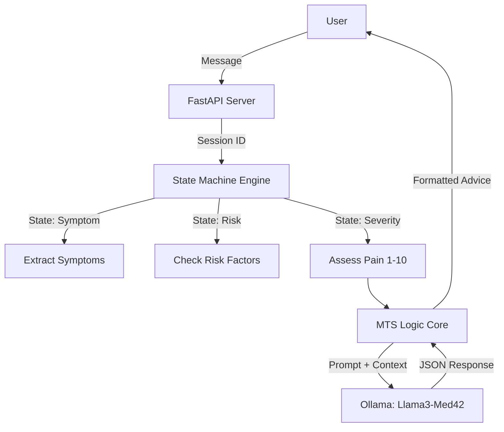

# CuraCore Triage Bot 🏥

  

An AI-powered medical triage system designed for the **CuraCore** platform. This bot uses a strict **State Machine** architecture to guide patients through a clinical intake process and applies the **Manchester Triage System (MTS)** logic to assess urgency. It runs locally using **Ollama** and **Meta's Llama 3** (Med42 fine-tune), ensuring patient data privacy.

---

## 🚀 Features

* **Logic-Driven Triage:** Uses the Manchester Triage System (MTS) to classify cases as Red, Orange, Yellow, Green, or Blue.
* **State Machine Architecture:** Prevents the AI from hallucinating or skipping critical questions (e.g., forces Symptom -> History -> Severity flow).
* **Privacy First:** Runs 100% locally using Ollama; no patient data is sent to external clouds.
* **Safety Guardrails:** Keyword-based overrides to detect critical emergencies (e.g., "Heart Attack") instantly.
* **Structured Output:** Returns strictly formatted JSON for easy frontend integration.

---

## 🛠️ Architecture

The system follows a linear clinical pipeline enforced by Python logic, using the LLM only for reasoning and natural language generation.



---

## 📋 Prerequisites

* **Python 3.10+**
* **Ollama** installed and running ([Download Here](https://ollama.com))
* **RAM:** Minimum 8GB (16GB recommended for 8B models)

---

## ⚡ Quick Start

### 1. Clone the Repository

```bash
git clone [https://github.com/yourusername/curacore-bot.git](https://github.com/yourusername/curacore-bot.git)
cd curacore-bot

```

### 2. Set Up the Environment

```bash
# Create a virtual environment
python -m venv venv

# Activate it
# On Windows:
venv\Scripts\activate
# On Mac/Linux:
source venv/bin/activate

# Install dependencies
pip install -r requirements.txt

```

### 3. Initialize the AI Model

This creates a custom model named `curacore-med42` based on Llama 3 Med42 with our specific system prompts.

```bash
# Make sure Ollama is running first!
ollama pull thewindmom/llama3-med42-8b
ollama create curacore-med42 -f Modelfile

```

### 4. Run the API Server

```bash
python main.py

```

*The server will start at `http://0.0.0.0:8000*`

---

## 🔌 API Usage

You can interact with the bot via REST API.

**Endpoint:** `POST /chat`

**Request:**

```json
{
  "user_id": "patient_123",
  "message": "I have a sharp pain in my chest"
}

```

**Response:**

```json
{
  "response": "I understand. To ensure safety, do you have any chronic conditions (Diabetes, BP, Heart issues) or allergies?",
  "current_state": "RISK_ASSESSMENT"
}

```

---

## 📁 Project Structure

* `main.py`: The FastAPI server entry point.
* `bot_engine.py`: Contains the `TriageBot` class and State Machine logic.
* `prompts.py`: Stores the MTS medical protocols and System Prompts.
* `config.py`: Configuration settings (Model names, API ports).
* `Modelfile`: The blueprint for the custom Ollama model.

---

## ⚠️ Disclaimer

**This software is a prototype for educational and developmental purposes.**
It is **not** a certified medical device. The advice generated by this AI should never replace professional medical consultation. In case of emergency, contact local emergency services immediately.

